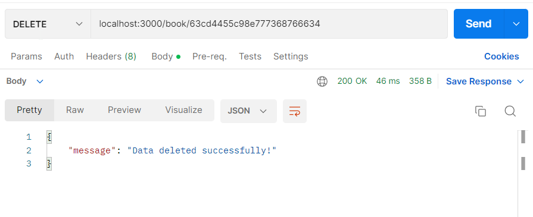

🚀✨ Proposta do projeto.
Criação de uma API para gravar/disponibilizar os dados dos livros que li no ano de 2022 e que mais gostei. A proposta inicial foi me auto-desafiar nos conceitos da construção, modelagem dos dados no banco, conhecer mais sobre a ferramenta para servidor Web Express, banco de dados MondoDb, Compilador Java Babel, biblioteca nodemon e para interagir com a API foi utilizado a ferramenta Postman.

🧠✨ O que aprendi
Conceitos de comunicação com banco de dados e suas dependências, estruturação lógica de um projeto de API, funcionalidades que os controllers, models e routes exercem no projeto e como os métodos get, post, put e delete podem ser realizados.

🔧✨ Tecnologias utilizadas
JavaScript e NodeJs

💻✨ Rodando o projeto
Para rodar o repositório é necessário clonar o mesmo. O banco de dados MongoDb também é necessário ser instalado. Caso utilize o VS Code, executar o comando: npm start para que web server seja iniciado. Após realizado esta etapa já é possível interagir com a API pelas seguintes rotas:
 
 GET localhost:3000/book
 GETById localhost:3000/book/idDoBook
 POST   localhost:3000/book  "utilizar a estrutura de dados contida no Models"
 PUT   localhost:3000/book/idDoBook Identificar o campo que deseja alterar
 DELETE  localhost:3000/book/idDoBook o livro será excluído do banco de dados.

Segue algumas imagens para elucidar o funcionamento.

